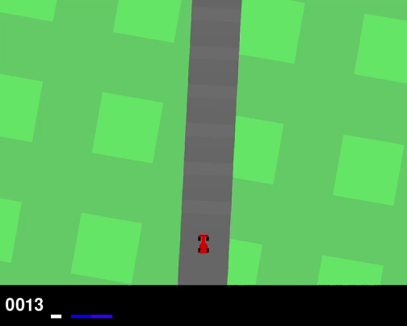

# Solving_Car_Racing_v3

*Authors*: Adrien Fu, Raphaël Faure  
*Date*: March 2025

## Repository Structure

```
.
├── CarRacing_v3_Fu_Faure.ipynb     # Notebook with training and evaluation
├── main.py                         
├── true_dqn.pt                     # Trained DQN model
├── true_output_PPO.txt             # PPO training logs
├── true_ppo_data.zip               # PPO training data and model
├── Report_RL.pdf                   # Full project report
├── Poster RL.pdf                   # Summary poster
├── README.md                       # Project documentation
├── images/                         # Folder containing visuals
└── .DS_Store                       # System file (can be ignored)
```


## Overview

This project uses Deep Reinforcement Learning to train agents to solve the CarRacing-v3 environment from Gymnasium. We compare two algorithms:

- **DQN (Deep Q-Network)** implemented from scratch
- **PPO (Proximal Policy Optimization)** using Stable-Baselines3

The goal is to teach agents to drive efficiently with partial observability.

## Environment

- **CarRacing-v3 (Discrete)**
- **Observation**: 96x96 RGB frames
- **Action space**: 5 discrete actions (nothing, left, right, gas, brake)
- **Rewards**: +1000/N per tile visited, -0.1 per frame, -100 if off track
  
The run example given in the gif is rendered in full-scale mode i.e., that is what a human sees playing this game.<br>

<p align='center'>

</p>


## Methods

### DQN

<p align='center'>

</p>

- Custom implementation with experience replay and target network
- Architecture: CNN → 2 FC layers
- 600,000 steps (~12h), final average reward: **605**
  

### PPO

<p align='center'>

</p>

- Stable-Baselines3 with CNN policy
- 650,000 steps (~3h), final average reward: **733**
- Faster convergence, but temporary policy collapse observed


